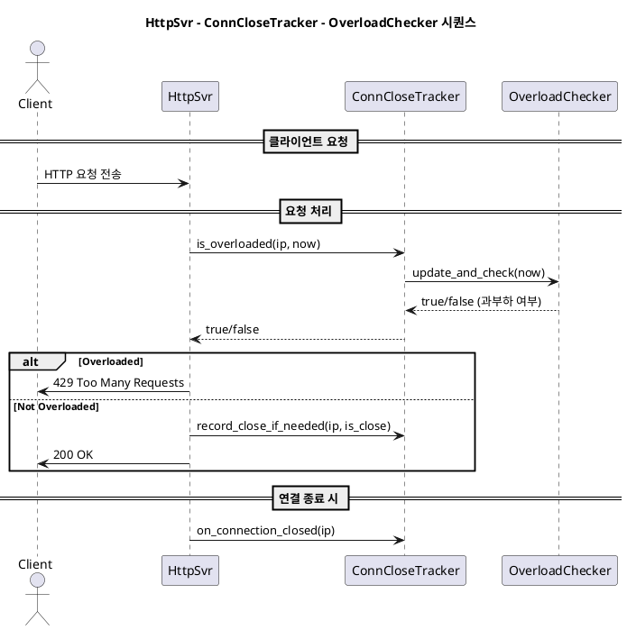

```plantuml
@startuml
title HttpSvr - ConnCloseTracker - OverloadChecker 시퀀스

actor Client
participant HttpSvr
participant ConnCloseTracker
participant OverloadChecker

== 클라이언트 요청 ==

Client -> HttpSvr : HTTP 요청 전송

== 요청 처리 ==

HttpSvr -> ConnCloseTracker : is_overloaded(ip, now)
ConnCloseTracker -> OverloadChecker : update_and_check(now)
OverloadChecker --> ConnCloseTracker : true/false (과부하 여부)
ConnCloseTracker --> HttpSvr : true/false

alt Overloaded
    HttpSvr -> Client : 429 Too Many Requests
else Not Overloaded
    HttpSvr -> ConnCloseTracker : record_close_if_needed(ip, is_close)
    HttpSvr -> Client : 200 OK
end

== 연결 종료 시 ==

HttpSvr -> ConnCloseTracker : on_connection_closed(ip)

@enduml

```
