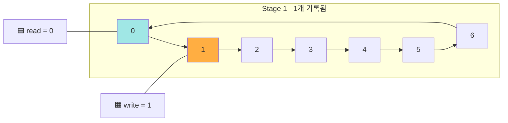

## 정의 

- 컴퓨터 공학에서 circular 버퍼는 circualr queue, cyclic buffer 또는 링버퍼라고 불린다.
- 링버퍼는 마치 끝에서 끝까지 연결된 것처럼 단일의 고정 크기 버퍼를 사용하는 데이터 구조다.


## Overview


- 24KB 의 키보드용 circular buffer 이미지
- microprocessor 가 응답이 없어서, `write` pointer 가 `read` pointer 를 만날 때, buffer 는 keystroke 기록을 멈춘다.
- keystroke 을 멈추는 것처럼 ring buffer 의 overwrite 을 방지하는 것은 어플리케이션의 기능에 따라 달라진다. 


## 동작 과정

1. 초기 상태 

```mermaid
flowchart LR
    subgraph RingBuffer [Ring Buffer (7 segments)]
        A0["0"] --> A1["1"]
        A1 --> A2["2"]
        A2 --> A3["3"]
        A3 --> A4["4"]
        A4 --> A5["5"]
        A5 --> A6["6"]
        A6 --> A0
    end

    style A0 fill:#a0e7e5,stroke:#000,color:#000
    style A3 fill:#ffae42,stroke:#000,color:#000

    note1["🟦 read = 0"]
    note2["🟧 write = 3"]

    note1 --- A0
    note2 --- A3
```


2. write 


3. read 와 충돌
```
flowchart LR
    subgraph Buffer4 [Stage 4 - overwrite 직전]
        B40["0"] --> B41["1"]
        B41 --> B42["2"]
        B42 --> B43["3"]
        B43 --> B44["4"]
        B44 --> B45["5"]
        B45 --> B46["6"]
        B46 --> B40
    end

    style B40 fill:#e29578
    style B41 fill:#ffd6a5
    style B42 fill:#ffd6a5
    style B43 fill:#ffd6a5
    style B44 fill:#ffd6a5
    style B45 fill:#ffd6a5
    style B46 fill:#ffd6a5

    note41["🟦 read = 0"]
    note42["🟧 write = 0 ❗️(위험)"]

    note41 --- B40
    note42 --- B40
```
